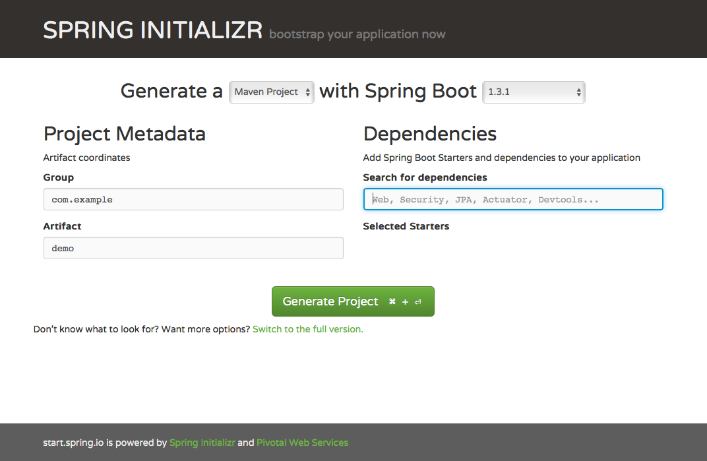

# Voorbereiden van Docker op je laptop

Ga naar de site docker.com

- Windows: voor installatie zie [hier](https://docs.docker.com/windows/step_one)
- Mac: voor installatie zie [hier](https://docs.docker.com/mac/step_one/)
- Voor alle echte OS-en: voor installatie zie [hier](https://docs.docker.com/linux/step_one/)

## Enkele handige commando’s

    docker run -it <imageId of imageName>                       | Maak en start container op de terminal
    docker run -d <imageId of imageName>                        | Maak en start container als deamon
	    -p <hostport>:<dockerport>                              | Voeg een poort op de container toe
	    —rm                                                     | Ruim container op na afsluiten
	    —name <containername>                                   | Kies een eigen containername
    docker start <containerid of -name>                         | Herstart een container
    docker stop <containerid of -name>                          | Stop een container
    docker rm <containerid of -name>                            | Verwijders een container
    docker ps                                                   | Toon overzicht van actieve containers
	    -a                                                      | Toon ook gestopte containers
    docker images                                               | Geef een overzicht van alle images
    docker exec -it <containerid of -name> /bin/bash            | Opent een shell in de container

    docker rmi <imageid of -name>                               | Verwijder image
    docker rm `docker images | awk '{print $1}’`                | Verwijder alle gestopte containers
    docker rmi `docker images | grep none | awk '{print $3}’`   | Verwijder alle images zonder image tag
    

# Maken van het Spring Boot project Restservice

Ga naar de site [start.spring.io](http://start.spring.io/)

- Voer bij dependency “Web” in en kies “Full stack web development with Tomcat and Spring MVC”
- Kies Generate project
- Open het gedownloade project in een IDE (IntelliJ, Eclipse, Netbeans, etc.)

## Toelichting op de pom-file

- De verwijzing naar de parent zorgt o.a. voor het dependency management
- De spring-boot-starter-web dependency zorgt voor het laden van de Spring Boot omgeving.
- De spring-boot-maven-plugin zorgt voor de creatie van de Spring Boot jar, incl. de embedded Tomcat container.

## Toelichting op de Java file

De @SpringBootApplicatie laadt alle aspecten van de Spring boot applicatie.

## Toevoegen van een rest controller aan de RestserviceApplication

Voeg aan de file van RestserviceApplication.java toe:

	@RestController
	class MyRestController {

	    @RequestMapping("/restdemo")
	    public String restdemo() {
		    return "Reply from restdemo";
	    }
	}

## Starten van de Spring Boot applicatie

	mvn clean install spring-boot:run

Spring Boot applicatie laden in een Docker container

# Toevoegen aan de .pom file:

    <plugin>
    	<groupId>com.spotify</groupId>
    	<artifactId>docker-maven-plugin</artifactId>
    	<version>0.3.7</version>
    	<configuration>
    		<imageName>quintor/restservice</imageName>
    		<baseImage>java:openjdk-8-jdk</baseImage>
    		<entryPoint>["java", "-jar", "/${project.build.finalName}.jar"]</entryPoint>
    		<resources>
    			<resource>
    				<targetPath>/</targetPath>
    				<directory>${project.build.directory}</directory>
    				<include>${project.build.finalName}.jar</include>
    			</resource>
    		</resources>
    		<exposes>
    			<expose>8080</expose>
    		</exposes>
    	</configuration>
    </plugin>

## Toelichting op de configuratie

- Het imagename element bepaalt de docker image name.
- Het baseimage element bepaalt de parent image waarvan deze image gaat erven.
- Het entrypoint definieert het commando dat uitgevoegd moet worden bij het opstarten van de docker container.
- De resources geven de elementen aan die in de docker image gekopieerd moeten worden.
- De expose geeft de poort aan op de docker container die open moet staan.

## Bouwen van de Docker image

	mvn clean install docker:build

# Project RestClient

Geen bijzonderheden

# Docker compose

- Ga naar de directory src/docker-compose
- Geef commando: docker-compose up
- Er worden nu 2 dockers gestart, die gekoppeld zijn

## Uitleg over de docker-compose file

    web:                            id van de docker container
      image: quintor/restclient     tag van de te starten image
      ports:
       - "8080:8080"                lijst van de te openen poorten
      links:
       - restservice                id van de docker container waaraan te koppelen
                                    dit is wordt ook als host in de /etc/hosts file toegevoegd
    restservice:
      image: quintor/restservice

